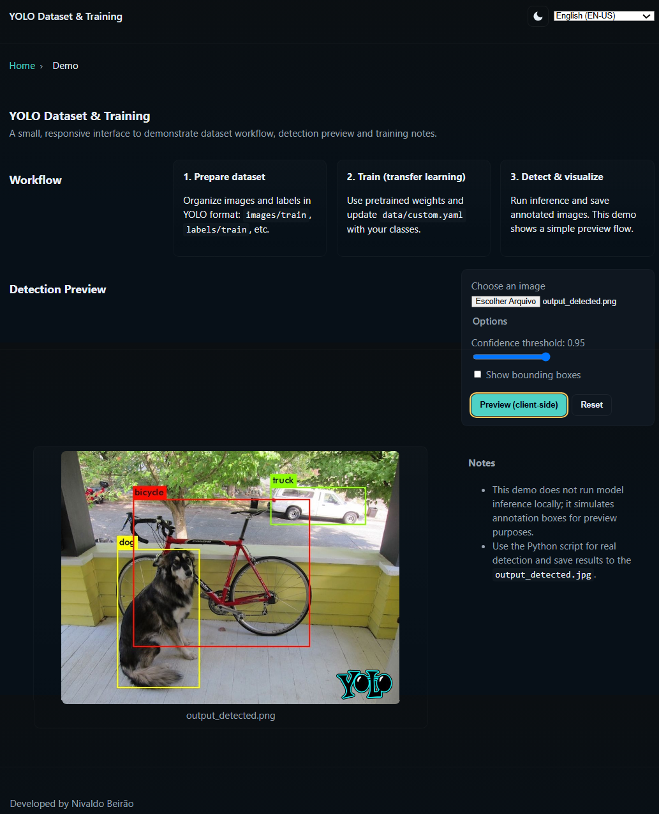

# Creation of a Dataset and Training of the YOLO Network

Project developed at Machine Learning Specialist Training Bootcamp, under the guidance of specialist [Diego Renan](https://github.com/diegobrunoDIO "Diego Renan").

In this project, we will label a dataset and train the YOLO network.
The work must include at least two retrained detection classes, in addition to the classes the model was already trained on prior to transfer learning.

An example of the expected result can be seen in the image:

Figure 1: Detection in images using the YOLO network.

A small, semantic, accessible and responsive static UI to accompany a YOLO dataset and training workflow.

This repository use PYTHON and contains a minimal front-end demo (HTML/CSS/JS) with:

- **Dark-first** theme with a light mode toggle (moon/sun icons).
- **Multilingual** UI: English (EN-US), Portuguese (PT-BR), Spanish (ES-ES) and Spanish Latin (ES-LA).
- **Backend**: to run the Python parts of the project locally:
    - Ensure you have Python 3.8+ and a virtual environment set up.
    - Install dependencies (example for YOLOv5):
    `pip install -r requirements.txt`
    - Prepare your dataset in YOLO format and update `data/custom.yaml` with `nc` and `names`.
    - Run training (transfer learning) with a pretrained weight (example):
    `python train.py --img 640 --batch 16 --epochs 50 --data data/custom.yaml --weights yolov5s.pt --name custom_run`
    - After training, run inference with your trained weights and save the annotated image:
    `python detect_and_draw.py --weights runs/train/custom_run/weights/best.pt --source input.jpg --output output_detected.jpg`
    - Open the saved `output_detected.jpg` in any image viewer or load it into the demo preview.
- **Accessibility** features: skip link, ARIA labels, keyboard shortcuts and focus styles.
- **Responsiveness** for desktop, tablet and mobile.
- A simple **client-side preview** that simulates bounding boxes for demonstration (does not run model inference).

## Technologies Used

- **Python**: Used for dataset preparation, transfer-learning training and inference. Typical commands:
  - Train (example using YOLOv5):

    ```bash
    python train.py --img 640 --batch 16 --epochs 50 --data data/custom.yaml --weights yolov5s.pt --name custom_run
    ```
  
  - Inference and save annotated image (example using a detection script):

    ```bash
    python detect_and_draw.py --weights runs/train/custom_run/weights/best.pt --source input.jpg --output output_detected.jpg
    ```

- **HTML**: Semantic HTML with header, main, nav and footer.
- **CSS**`: CSS variables, dark-first theme, responsive layout and accessible focus styles.
- **JavaScript**`: Theme toggle, language selection, preview simulation and persistence (localStorage).

## Usage

1. Open `index.html` in a browser (no server required).
2. Use the **theme toggle** (top-right) to switch between dark and light modes.
3. Use the **language selector** to switch UI language. The selection and theme persist in `localStorage`.
4. Use the **Preview** form to select an image from your device. The demo simulates bounding boxes for visualization only.

> For real detection, run your YOLO Python script (e.g., `detect_and_draw.py`) and point it to your trained weights and input image. Save the annotated image and open it in this demo or any image viewer.

## Accessibility & Keyboard Shortcuts

- **Skip to content** link is available at the top.
- **Theme toggle**: press `T` to toggle dark/light.
- **Language cycle**: press `L` to cycle available languages.
- All interactive elements have focus styles and ARIA attributes.

## Notes

- This project is intentionally lightweight and meant for local demonstration on desktop/tablet/mobile.
- The preview boxes are simulated client-side and are not the result of model inference.
- To integrate real detections, adapt the Python inference script to save annotated images and load them into the preview area.



[LICENSE](/LICENSE)
